# GB28181 Video Surveillance Platform / GB28181 视频监控平台

A modern, high-performance video surveillance management platform based on the GB/T 28181-2016 standard. Supports device auto-registration, real-time preview (H.264/H.265), cloud storage management, AI-powered object detection, and a cross-platform mobile app built with Expo.

基于 GB/T 28181-2016 标准构建的现代化高性能视频监控管理平台。支持设备自动注册、由 ZLMediaKit 驱动的实时预览（H.264/H.265）、云端存储管理、基于 AI 的目标检测，以及基于 Expo 构建的跨端移动 App。

## 🏗 System Architecture / 系统架构

The system consists of five core components:
系统主要由以下五个核心组件构成：

1.  **Backend (Java/Spring Boot)**: Handles GB28181 SIP signaling, device management, user authentication, and business logic.
    -   **后端 (Java/Spring Boot)**：处理 GB28181 SIP 信令、设备管理、用户认证及业务逻辑。
2.  **Frontend (React/Vite)**: Provides both the desktop management console and the mobile H5 pages under `/m/*`.
    -   **前端 (React/Vite)**：同时提供桌面端管理台与 `/m/*` 移动端 H5 页面。
3.  **Mobile App (Expo / React Native WebView)**: A cross-platform native shell for iOS and Android, loading the mobile H5 pages and extending them with native capabilities.
    -   **移动 App (Expo / React Native WebView)**：面向 iOS 和 Android 的跨端原生壳层，通过 WebView 承载移动端 H5，并补充原生能力。
4.  **Media Server (ZLMediaKit)**: High-performance streaming server supporting RTSP/RTMP/HTTP-FLV/HLS/WebRTC.
    -   **流媒体服务器 (ZLMediaKit)**：高性能流媒体服务，支持 RTSP/RTMP/HTTP-FLV/HLS/WebRTC 等多种协议。
5.  **AI Service (Python/YOLOv8)**: Real-time object detection (e.g., person detection) on video streams.
    -   **AI 服务 (Python/YOLOv8)**：基于 YOLOv8 的实时视频流目标检测（如人形检测）。

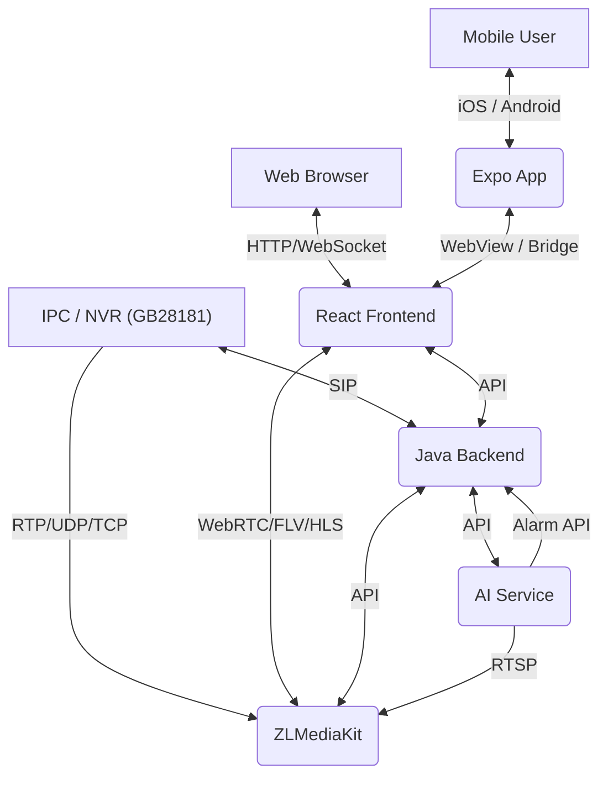

## Docker Images / 镜像下载(已经构建好)

- **AI Algorithm Image / AI 算法镜像**: `docker pull dingjianchen/gb28181-ai:latest`
- **GB28181 Program Image / GB28181 程序镜像**: `docker pull dingjianchen/gb28181:latest`

## 📸 Screenshots / 系统截图

### 1. Login / 登录
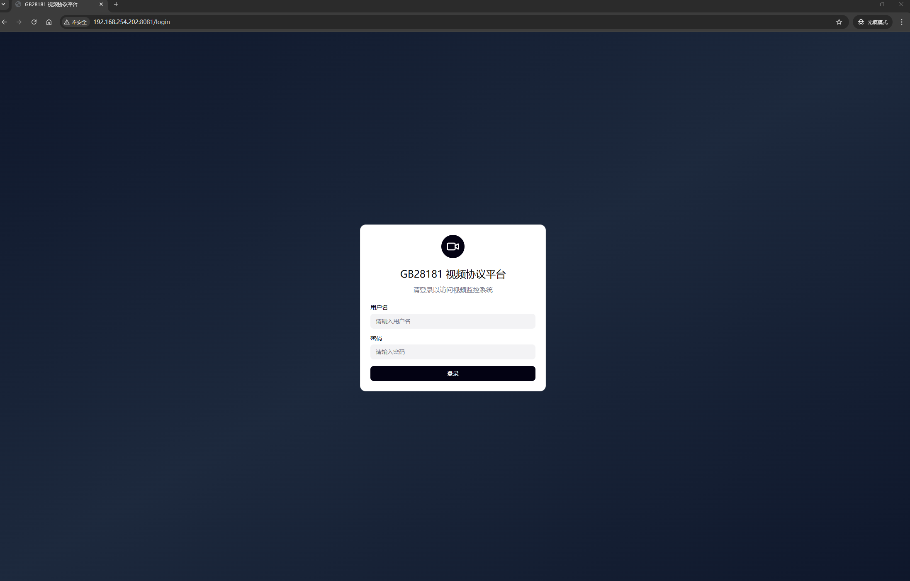

### 2. Device Management / 设备管理
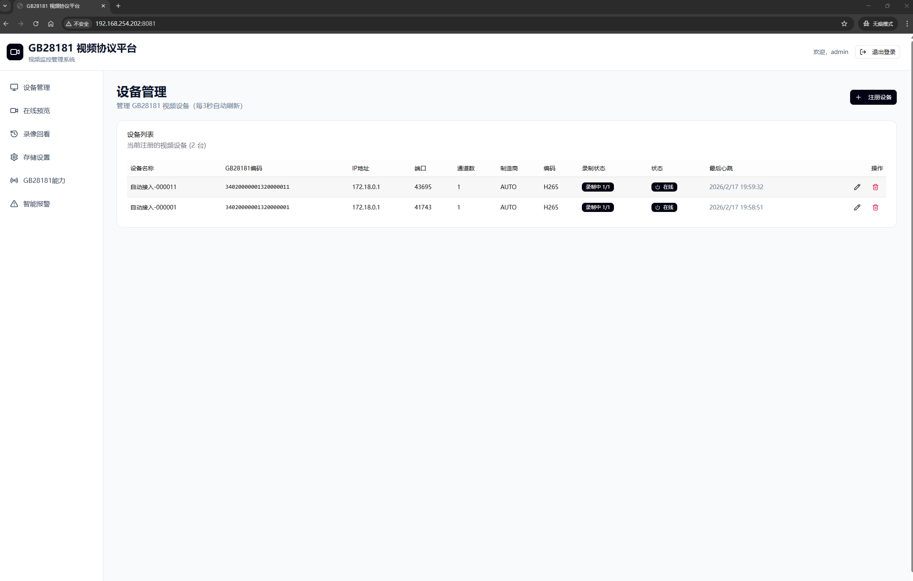

### 3. Live Preview / 在线预览
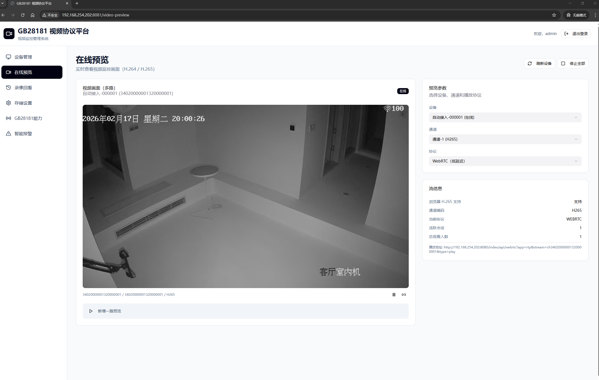

### 4. Playback / 录像回看
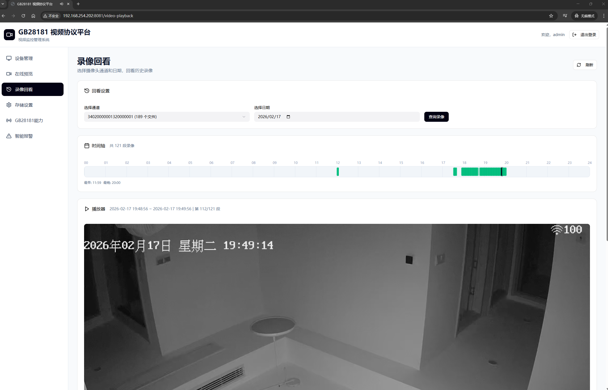

### 5. Storage Settings / 存储设置
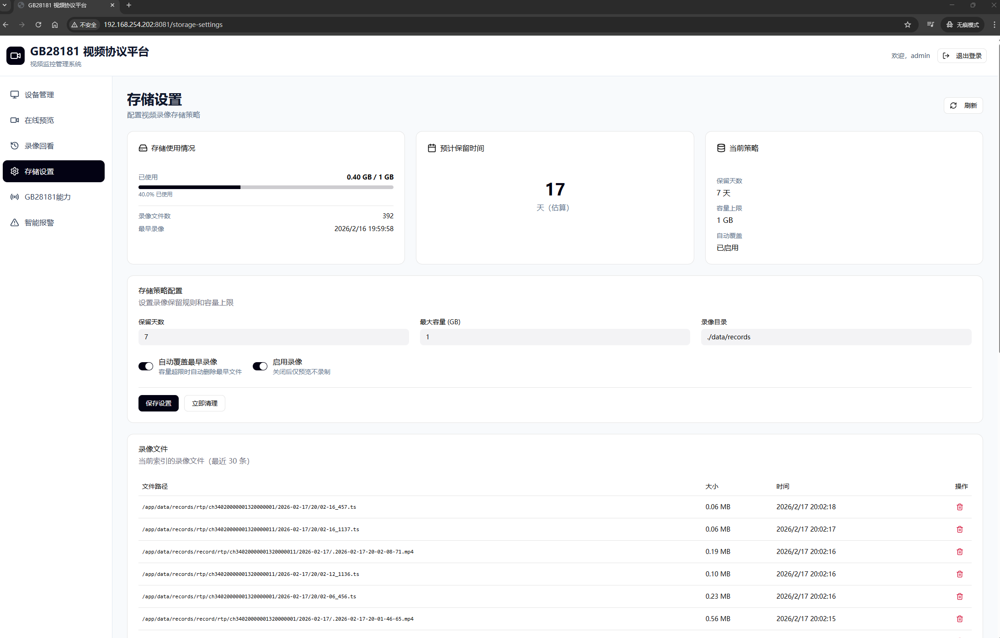

### 6. Capability Center / 能力中心
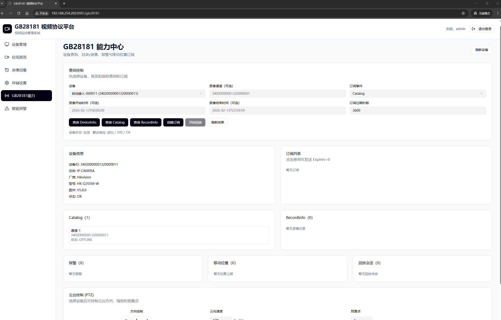

### 7. Smart Alarm / 智能报警
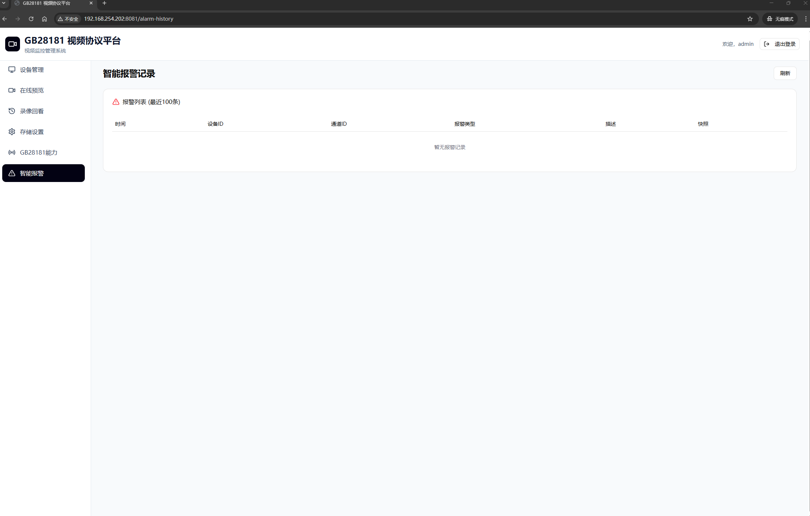

### 8. App Home / App 首页
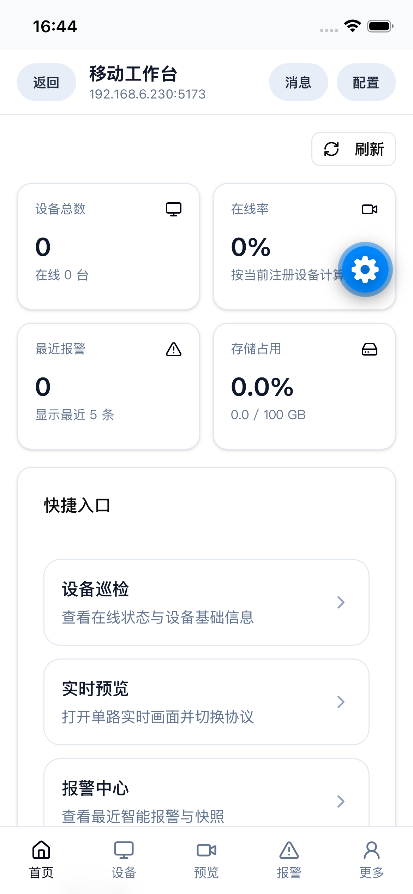

### 9. App Devices / App 设备
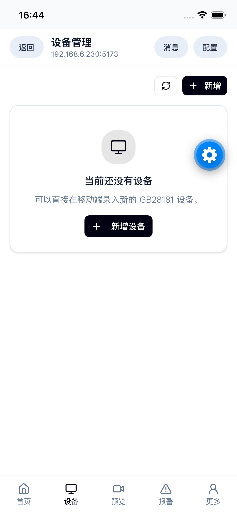

### 10. App Live Preview / App 实时预览
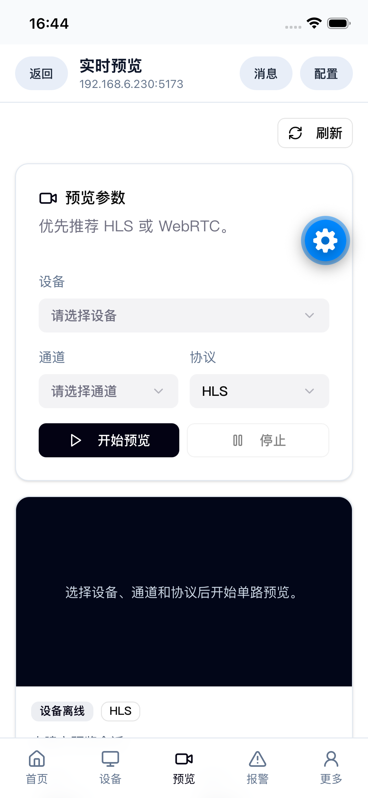

### 11. App More / App 更多
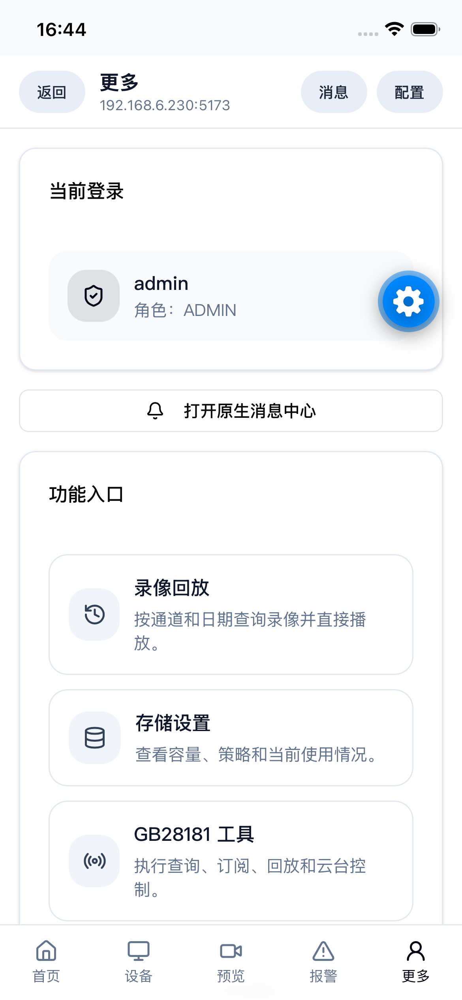

## ✨ Features / 系统功能

### 1. Device Management / 设备管理
-   **Auto-Registration**: Automatically accepts GB28181 registration from IPCs and NVRs.
    -   **自动注册**：自动接受 IPC 和 NVR 的 GB28181 注册请求。
-   **Channel Discovery**: Automatically syncs device channels and status.
    -   **通道发现**：自动同步设备通道及在线状态。
-   **Status Monitoring**: Real-time Keepalive monitoring.
    -   **状态监控**：实时心跳保活检测。

### 2. Live Preview / 在线预览
-   **Multi-Protocol Support**: WebRTC (Low Latency), HTTP-FLV, HLS.
    -   **多协议支持**：WebRTC（低延迟）、HTTP-FLV、HLS。
-   **H.265 & H.264**: Supports modern H.265 (HEVC) codecs web playback (via Wasm or native support).
    -   **H.265 & H.264**：支持 H.265 (HEVC) 编码的 Web 端播放（通过 Wasm 或原生支持）。
-   **PTZ Control**: (Supported via API) Pan, Tilt, Zoom control.
    -   **云台控制**：（API 支持）云台转动与变焦控制。

### 3. Cloud Storage / 云端存储
-   **Server-Side Recording**: Record streams to MP4 on the server.
    -   **服务端录像**：支持服务端 MP4 录像存储。
-   **Storage Policy**: Configure retention days and max storage usage.
    -   **存储策略**：配置录像保留天数及最大存储空间。
-   **Auto-Cleanup**: Automatically deletes old records to free up space.
    -   **自动清理**：自动清理过期录像释放空间。

### 4. AI Recognition / AI 智能识别
-   **Object Detection**: Built-in YOLOv8 integration for detecting objects (e.g., Person).
    -   **目标检测**：内置 YOLOv8 模型，支持目标（如：人）检测。
-   **Smart Alarms**: Generates alarms with snapshots when targets are detected.
    -   **智能报警**：检测到目标时自动生成报警并抓拍快照。

### 5. PTZ Control / 云台控制
-   **Pan, Tilt, Zoom**: Control camera movement and zoom levels via API.
    -   **云台转动与变焦**：通过 API 控制摄像头的移动和变焦。
-   **Integration**: Seamlessly integrates with the GB28181 protocol for real-time PTZ operations.
    -   **集成**：与 GB28181 协议无缝集成，实现实时云台操作。
-   **Customizable**: Supports custom PTZ presets and patrol routes.
    -   **可定制**：支持自定义云台预置位和巡航路径。

### 6. Mobile App / 移动端 App
-   **Cross-Platform App Shell**: Built with Expo and `react-native-webview`, supporting iOS and Android with a unified codebase.
    -   **跨端 App 壳层**：基于 Expo 与 `react-native-webview` 构建，使用统一代码同时支持 iOS 和 Android。
-   **Mobile H5 Business Pages**: Covers login, home dashboard, device management, live preview, alarms, playback, storage, and GB28181 tools.
    -   **移动端 H5 业务页**：覆盖登录、首页工作台、设备管理、实时预览、报警中心、录像回放、存储设置与 GB28181 工具。
-   **Native-H5 Bridge**: Supports native title sync, back navigation, server address configuration, and pull-to-refresh.
    -   **原生与 H5 桥接**：支持标题同步、返回控制、服务器地址配置与下拉刷新。
-   **Native Enhancements**: Supports file download, system share, message center, local notification testing, and push token registration.
    -   **原生增强能力**：支持文件下载、系统分享、消息中心、本地通知测试与 Push Token 注册。

## 🚀 Getting Started / 快速开始

### Prerequisites / 前置要求
-   Docker & Docker Compose

### Installation / 安装部署

1.  **Clone the repository / 克隆仓库**
    ```bash
    git clone https://github.com/your-repo/gb28181-video-platform.git
    cd gb28181-video-platform
    ```

2.  **Configure Environment / 配置环境**
    Edit `docker-compose.yaml` to set your local IP address:
    修改 `docker-compose.yaml` 设置本地 IP 地址：
    
    ```yaml
    services:
      app:
        environment:
          - APP_GB28181_LOCAL_IP=192.168.1.100  # Your LAN IP
          - APP_GB28181_MEDIA_IP=192.168.1.100  # Your LAN IP
    ```

3.  **Start Services / 启动服务**
    ```bash
    docker-compose up -d --build
    ```

4.  **Access the Platform / 访问平台**
    -   **Web UI**: http://localhost:5173 (or configured port)
    -   **API Doc**: http://localhost:8080/swagger-ui.html
    -   **Default Account**: `admin` / `admin123`

## 📱 Mobile App / 移动端 App

The mobile app lives under the `app/` directory and uses Expo as the native shell. It loads the mobile H5 routes from the frontend such as `/m/login`, `/m/home`, `/m/devices`, `/m/preview`, `/m/alarms`, `/m/playback`, `/m/settings`, and `/m/gb28181`.

移动端 App 位于 `app/` 目录，使用 Expo 作为原生壳层，承载前端中的移动端 H5 路由，例如 `/m/login`、`/m/home`、`/m/devices`、`/m/preview`、`/m/alarms`、`/m/playback`、`/m/settings` 和 `/m/gb28181`。

### 1. App Features / App 功能

-   Same account system and backend APIs as the Web platform.
    -   与 Web 平台共用同一套账号体系与后端接口。
-   Native shell capabilities including title bar, back control, server address settings, and pull-to-refresh.
    -   提供标题栏、返回控制、服务器地址设置和下拉刷新等原生壳层能力。
-   Native file download and system share for snapshots and recordings.
    -   支持快照与录像文件的原生下载和系统分享。
-   Built-in message center with local notification testing and push token registration flow.
    -   内置消息中心，支持本地通知测试与 Push Token 注册流程。

### 2. Start the App / 启动 App

1.  **Start the frontend mobile H5 / 启动前端移动端页面**
    ```bash
    cd frontend
    npm run dev
    ```

2.  **Start the backend / 启动后端**
    ```bash
    export JAVA_HOME=/Library/Java/JavaVirtualMachines/zulu-25.jdk/Contents/Home
    export PATH="$JAVA_HOME/bin:$PATH"
    sh mvnw spring-boot:run
    ```

3.  **Start the Expo app / 启动 Expo App**
    ```bash
    cd app
    EXPO_PUBLIC_GB28181_EMBED_URL=http://192.168.6.230:5173 npx expo start -c
    ```

4.  **Run on device / 在设备上运行**
    -   Use `npx expo start --ios` or `npx expo start --android` to open the simulator.
    -   使用 `npx expo start --ios` 或 `npx expo start --android` 打开模拟器。
    -   Make sure the frontend dev server address is reachable from your phone or simulator.
    -   请确保前端开发地址可以被手机或模拟器访问。

### 3. App Notes / App 使用说明

-   The app opens the mobile H5 frontend address, not the backend API address directly.
    -   App 打开的是移动端 H5 前端地址，而不是后端 API 地址本身。
-   If the server address changes, it can be updated from the app's native settings page.
    -   如果服务地址变更，可以直接在 App 的原生配置页中修改。
-   For remote push delivery, a real device is recommended for end-to-end verification.
    -   如需验证远程 Push 完整链路，建议使用真机进行端到端测试。

## 🪟 Windows Packaging & Run / Windows 打包与运行

Use the built-in script to build frontend + backend and package a self-contained Windows app image.
使用仓库内置脚本即可完成前后端构建，并打包为自包含 Windows 应用（无需额外安装 Java 运行时）。

### 1. Prerequisites / 前置要求
-   Windows 10/11
-   PowerShell
-   Node.js + npm
-   JDK 25（默认脚本路径：`C:\Program Files\Eclipse Adoptium\jdk-25.0.0.36-hotspot`）

### 2. Build / 打包

```powershell
.\build-windows.ps1
```

If your JDK is installed in another location, pass `-JavaHome`:
如果 JDK 路径不同，可显式传入：

```powershell
.\build-windows.ps1 -JavaHome "C:\Path\To\JDK25"
```

### 3. Run / 运行

After packaging, the output is under `dist\video`:
打包完成后产物位于 `dist\video`：

-   `dist\video\video.exe`
-   `dist\video\run.bat`

Run either one to start the application.
执行任意一个即可启动程序。

## 🤖 AI Service Usage / AI 服务使用

The AI service runs separately and connects to ZLMediaKit to process video streams for object detection.
AI 服务独立运行，连接 ZLMediaKit 处理视频流并进行目标检测。

### 1. Prerequisites / 前置要求
-   Python 3.9+
-   CUDA (Optional, for GPU acceleration / 可选，用于 GPU 加速)

### 2. Startup / 启动服务

#### Method 1: Docker Compose (Recommended / 推荐)

##### Use Docker Image / 使用 Docker 镜像(已构建好)
Add the following service to your `docker-compose.yaml`:
在 `docker-compose.yaml` 中添加以下服务：

```yaml
  ai-service:
    image: dingjianchen/gb28181-ai:latest
    container_name: gb28181-ai
    restart: always
    environment:
      - JAVA_API_HOST=http://192.168.1.100:8081 # Backend API address / 后端 API 地址
      - ZLM_HOST=http://192.168.1.100:8080      # ZLMediaKit HTTP API address / ZLMediaKit HTTP API 地址
      - RTSP_HOST=192.168.1.100                 # Local LAN IP / 本机局域网 IP
      - YOLO_MODEL=yolov8n.pt                   # Model: yolov8n.pt, yolov8s.pt, etc.
    volumes:
      - ./snapshots:/app/snapshots              # Map snapshots directory / 映射快照目录
```

##### Build and Run / 构建和运行（自己构建镜像）
```bash
# 构建镜像（注意这次会安装 ffmpeg 等库）
docker build -t gb28181-ai-service .

# 启动容器
docker run -id --name ai-service \
  -e ZLM_HOST=http://192.168.254.202:8080 \
  -e JAVA_API_HOST=http://192.168.254.202:8081 \
  -e RTSP_HOST=192.168.254.202 \
  -e RTSP_HOST_PORT=8554  \
  gb28181-ai-service

docker logs -f ai-service
```
#### Method 2: Source Code / 源码启动

```bash
cd ai-service

# Install dependencies / 安装依赖
pip install -r requirements.txt

# Run the service / 启动服务
# Ensure ZLMediaKit and Java Backend are running first!
# 请确保 ZLMediaKit 和 Java 后端已启动！
python app.py
```

### 3. Configuration (Environment Variables) / 配置（环境变量）

You can configure the service by setting environment variables before running:
启动前可通过环境变量进行配置：

| Variable | Description | Default |
| :--- | :--- | :--- |
| `JAVA_API_HOST` | Backend API Address | `http://127.0.0.1:8081` |
| `ZLM_HOST` | ZLMediaKit HTTP API Address | `http://127.0.0.1:8080` |
| `RTSP_HOST` | RTSP Stream Host (Local IP) | `127.0.0.1` |
| `YOLO_MODEL` | YOLOv8 Model (n/s/m/l/x) | `yolov8n.pt` |
| `CONFIDENCE_THRESHOLD` | Detection Confidence (0.0-1.0) | `0.5` |

## ⚙️ Configuration / 配置说明

### Environment Variables / 环境变量

| Variable | Description (EN) | Description (CN) | Default |
| :--- | :--- | :--- | :--- |
| `APP_GB28181_LOCAL_IP` | SIP Signaling IP | SIP 信令监听 IP | `0.0.0.0` |
| `APP_GB28181_MEDIA_IP` | Media Server IP (Advertised) | 媒体流 IP（广播给设备） | `192.168.x.x` |
| `APP_ZLM_BASE_URL` | ZLMediaKit API URL | ZLMediaKit API 地址 | `http://127.0.0.1:80` |
| `YOLO_MODEL` | AI Model Path/Name | AI 模型路径/名称 | `yolov8n.pt` |

## 🛠 Technology Stack / 技术栈

-   **Backend**: Java 25, Spring Boot 4.x, Maven
-   **Frontend**: React 18, Vite, TypeScript, TailwindCSS, Shadcn/UI
-   **Mobile App**: Expo SDK 55, React Native, Expo Router, React Native WebView
-   **Streaming**: ZLMediaKit (C++)
-   **AI**: Python 3.9+, PyTorch, Ultralytics YOLO
-   **Database**: SQLite (Easy deployment)

## 📄 License

MIT License
